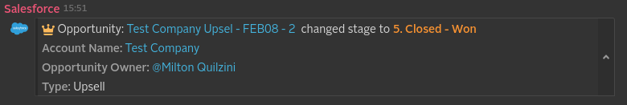
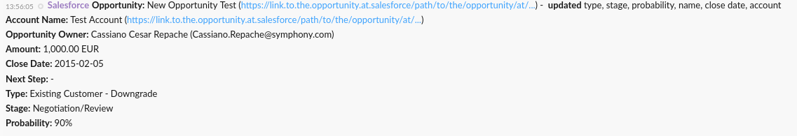
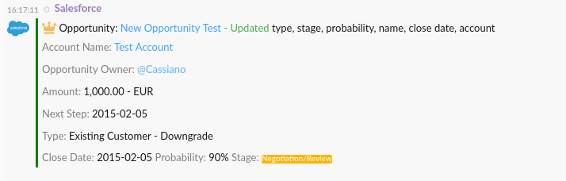

[](https://symphonyoss.atlassian.net/wiki/display/FM/Incubating) [](https://travis-ci.org/symphonyoss/App-Integrations-Salesforce) [](https://www.versioneye.com/user/projects/58d049f66893fd003b3c3dab)

# Salesforce WebHook Integration
The Salesforce WebHook Integration will allow you to receive notifications in Symphony when a Salesforce opportunity, account or an executive dashboard changes state.

## [Build Instructions](#build-instructions-for-the-java-developer)

## How it works
Unlike JIRA and GitHub, Salesforce does not provide out-of-the-box Webhook support. As such, while in beta, Symphony provides directly to customers an unmanaged package consisting of an Apex trigger and configuration object to achieve this functionality. As a Salesforce administrator, you can configure the unmanaged packaged with the webhook URL generated by the Salesforce Application available in the Symphony Market. You’ll then start receiving notifications for opportunity updates. Symphony will later distribute this integration through a managed Salesforce package.

## What formats and events it support and what it produces
Every integration will receive a message sent in a specific format (depending on the system it ingests) and will usually convert it into an "entity" before it reaches the Symphony platform. It will also, usually, identify the kind of message based on an "event" identifier, which varies based on the third-party system.

You can find more details about entities and the Symphony Message ML format [here](https://github.com/symphonyoss/App-Integrations-Core#the-message-ml-format).

Salesforce WebHook Integration currently deals with one event. 
The data already comes in a Symphony MessageML format (as it is generated by our Apex applications) and the only post-processing that Integration Bridge does before resending the payload is to check if the users mentioned in the payload do have identifiable accounts on the target Symphony platform. If they do, a "mention" tag will be added to the payload. Next, we'll detail the supported events:

### Opportunity Notification

The opportunity notification may have two different formats: XML or JSON

* XML Payload sent from Salesforce
```xml
<messageML>
  <entity type="com.symphony.integration.sfdc.event.opportunityNotification" version="1.0">
    <presentationML>
      Milton Quilzini updated Test Company Upsel - FEB08 - 2 (<a href="https://link.to.the.opportunity.at.salesforce/path/to/the/opportunity/at/salesforce"/>) to stage <b>5. Closed - Won</b>
    </presentationML>
    <attribute name="username" type="org.symphonyoss.string" value="test" />
    <entity type="com.symphony.integration.sfdc.opportunity" version="1.0">
      <attribute name="title" type="org.symphonyoss.string" value="Test Company Upsel - FEB08 - 2"/>
      <attribute name="link" type="com.symphony.uri" value="https://link.to.the.opportunity.at.salesforce/path/to/the/opportunity/at/salesforce"/>
      <attribute name="type" type="org.symphonyoss.string" value="Upsell"/>
      <attribute name="stage" type="org.symphonyoss.string" value="5. Closed - Won"/>
      <attribute name="closeDate" type="org.symphonyoss.time.rfc3339" value="2016-08-05T14:42:09.992Z"/>
      <entity name="arr" type="com.symphony.integration.sfdc.revenue" version="1.0">
        <attribute name="currency" type="org.symphonyoss.fin.ccy" value="USD"/>
        <attribute name="value" type="org.symphony.oss.number.double" value="288000.00"/>
      </entity>
      <entity name="owner" type="com.symphony.integration.sfdc.user" version="1.0">
        <attribute name="username" type="org.symphonyoss.string" value="mquilzini"/>
        <attribute name="displayName" type="org.symphonyoss.string" value="Milton Quilzini"/>
        <attribute name="emailAddress" type="org.symphonyoss.string" value="mquilzini@symphony.com"/>
      </entity>
    </entity>
    <entity type="com.symphony.integration.sfdc.account" version="1.0">
      <attribute name="name" type="org.symphonyoss.string" value="Test Company"/>
      <attribute name="link" type="com.symphony.uri" value="https://link.to.the.account.at.salesforce/path/to/the/account/at/salesforce"/>
      <attribute name="salesRegion" type="org.symphonyoss.string" value="Americas"/>
      <attribute name="renewalDate" type="org.symphonyoss.time.rfc3339" value="2016-08-05T14:42:09.992Z"/>
      <entity name="totalContractedArr" type="com.symphony.integration.sfdc.revenue" version="1.0">
        <attribute name="currency" type="org.symphonyoss.fin.ccy" value="USD"/>
        <attribute name="value" type="org.symphony.oss.number.double" value="288000.00"/>
      </entity>
      <entity name="owner" type="com.symphony.integration.sfdc.user" version="1.0">
        <attribute name="username" type="org.symphonyoss.string" value="mquilzini"/>
        <attribute name="displayName" type="org.symphonyoss.string" value="Milton Quilzini"/>
        <attribute name="emailAddress" type="org.symphonyoss.string" value="mquilzini@symphony.com"/>
      </entity>
    </entity>
    <entity name="author" type="com.symphony.integration.sfdc.user" version="1.0">
      <attribute name="username" type="org.symphonyoss.string" value="mquilzini"/>
      <attribute name="displayName" type="org.symphonyoss.string" value="Milton Quilzini"/>
      <attribute name="emailAddress" type="org.symphonyoss.string" value="mquilzini@symphony.com"/>
    </entity>
  </entity>
</messageML>
```

##### Message rendered on Symphony




* JSON Payload sent from Salesforce

```json
{
  "previous": {
    "opportunity": {
      "Type": "New Customer",
      "StageName": "Proposal/Price Quote",
      "Probability": "75%",
      "Name": "Old Opportunity Test",
      "CloseDate": "2015-02-12T00:00:00.000Z",
      "Account": {
        "Link": "https://link.to.the.opportunity.at.salesforce/path/the/opportunity/at/salesforce",
        "Name": "Opportunity plc",
        "Id": "00856003404oPCeAAM"
      }
    }
  },
  "current": {
    "opportunity": {
      "LastModifiedBy": {
        "Email": "Cassiano.Repache@symphony.com",
        "Name": "Cassiano Cesar Repache",
        "Id": "00578000000ZJrdAAG"
      },
      "Account": {
        "Link": "https://link.to.the.opportunity.at.salesforce/path/to/the/opportunity/at/salesforce",
        "Name": "Test Account",
        "Id": "00146000344oPCcAAM"
      },
      "Owner": {
        "Email": "rsanchez@symphony.com",
        "Name": "Robson Sanchez",
        "Id": "00546000000ZJrdAAG"
      },
      "TotalOpportunityQuantity": null,
      "Probability": "90%",
      "NextStep": "",
      "Amount": 1000.00,
      "StageName": "Negotiation/Review",
      "Type": "Existing Customer - Downgrade",
      "CurrencyIsoCode": "EUR",
      "CloseDate": "2015-02-05 08:00:00T00:00:00.000Z",
      "Link": "https://link.to.the.opportunity.at.salesforce/path/to/the/opportunity/at/salesforce",
      "Name": "New Opportunity Test",
      "Id": "00646002303IyLaAAK"
    }
  }
}
```

##### Generated Symphony entity (MessageML V1)

```xml
<?xml version="1.0" encoding="UTF-8"?>
<messageML>
   <b>Opportunity:</b>New Opportunity Test (<a href="https://link.to.the.opportunity.at.salesforce/path/to/the/opportunity/at/salesforce" />) - <b>updated</b>type, stage, probability, name, close date, account
   <br />
   <b>Account Name:</b>Test Account (<a href="https://link.to.the.opportunity.at.salesforce/path/to/the/opportunity/at/salesforce" />)
   <br />
   <b>Opportunity Owner:</b>Robson Sanchez (rsanchez@symphony.com)
   <br />
   <b>Amount:</b>1,000.00 EUR
   <br />
   <b>Close Date:</b>2015-02-05
   <br />
   <b>Next Step:</b> -
   <br />
   <b>Type:</b>Existing Customer - Downgrade
   <br />
   <b>Stage:</b>Negotiation/Review
   <br />
   <b>Probability:</b>90%
</messageML>
```

##### Message rendered on Symphony



##### Generated Symphony Message and Json entity (MessageML V2)

When the Integration Bridge posts messages through the Agent that has version equal or greater than '1.46.0' the
generated Symphony Message must follow the MessageML V2 specification.

More information about MessageML V2 specification can be accessed [here](https://symphonyoss.atlassian.net/wiki/display/WGFOS/MessageML+V2+Draft+Proposal+-+For+Discussion)

Following an example:

```xml
<messageML>
    <div class="entity" data-entity-id="OpportunityNotification">
        <card class="barStyle" accent="green" iconSrc="${entity['OpportunityNotification'].current.opportunity.URLIconIntegration}">
            <header>
                
                <span class="tempo-text-color--secondary">Opportunity: </span>
                <a class="tempo-text-color--link" href="${entity['OpportunityNotification'].current.opportunity.Link}">${entity['OpportunityNotification'].current.opportunity.Name}</a>
                <span class="tempo-text-color--green"> - ${entity['OpportunityNotification'].current.opportunity.CreatedOrUpdated}</span>
                <span>${entity['OpportunityNotification'].current.opportunity.UpdatedFields}</span>
            </header>
            <body>
                <div>
                    <span class="tempo-text-color--secondary">Account Name:</span>
                    <#if (entity['OpportunityNotification'].current.opportunity.Account.Link)??>
                        <a class="tempo-text-color--link" href="${entity['OpportunityNotification'].current.opportunity.Account.Link}">${entity['OpportunityNotification'].current.opportunity.Account.Name}</a>
                    <#else>
                        <span>${entity['OpportunityNotification'].current.opportunity.Account.Name}</span>
                    </#if>
                </div>
                <br/>
                <div>
                    <span class="tempo-text-color--secondary">Opportunity Owner:</span>
                    <#if (entity['OpportunityNotification'].current.opportunity.Owner.hasOwnerAtSymphony)??>
                        <mention email="${entity['OpportunityNotification'].current.opportunity.Owner.Email}" />
                    <#else>
                        <span>${entity['OpportunityNotification'].current.opportunity.Owner.Name} - ${entity['OpportunityNotification'].current.opportunity.Owner.Email}</span>
                    </#if>
                </div>
                <br/>
                <div>
                    <span class="tempo-text-color--secondary">Amount:</span>
                    <span>${entity['OpportunityNotification'].current.opportunity.Amount} - ${entity['OpportunityNotification'].current.opportunity.CurrencyIsoCode}</span>
                </div>
                <br/>
                <div>
                    <span class="tempo-text-color--secondary">Next Step:</span>
                    <span>${entity['OpportunityNotification'].current.opportunity.CloseDate}</span>
                </div>
                <br/>
                <div>
                    <span class="tempo-text-color--secondary">Type:</span>
                    <span>${entity['OpportunityNotification'].current.opportunity.Type}</span>
                </div>
                <hr/>
                <div>
                    <span class="tempo-text-color--secondary">Close Date:</span>
                    <span>${entity['OpportunityNotification'].current.opportunity.CloseDate}</span>
                    <span class="tempo-text-color--secondary">Probability:</span>
                    <span>${entity['OpportunityNotification'].current.opportunity.Probability}</span>
                    <span class="tempo-text-color--secondary">Stage:</span>
                    <span class="tempo-text-color--white tempo-bg-color--yellow tempo-token">${entity['OpportunityNotification'].current.opportunity.StageName}</span>
                </div>
            </body>
        </card>
    </div>
</messageML>
```

```json
{  
   "OpportunityNotification":{  
      "type":"com.symphony.integration.salesforce.event.v2.OpportunityNotification",
      "version":"1.0",
      "current":{  
         "type":"com.symphony.integration.salesforce.current",
         "version":"1.0",
         "opportunity":{  
            "type":"opportunity",
            "version":"1.0",
            "Name":"New Opportunity Test",
            "Type":"Existing Customer - Downgrade",
            "Link":"https://link.to.the.opportunity.at.salesforce/path/to/the/opportunity/at/salesforce",
            "NextStep":"-",
            "StageName":"Negotiation/Review",
            "CloseDate":"2015-02-05",
            "Probability":"90%",
            "Amount":"1,000.00",
            "CurrencyIsoCode":"EUR",
            "UpdatedFields":"type, stage, probability, name, close date, account",
            "CreatedOrUpdated":"Updated",
            "URLIconIntegration":"https://nexus2.symphony.com/apps/salesforce/img/salesforce.svg",
            "IconCrown":"https://nexus2.symphony.com/apps/salesforce/img/new_opportunity.svg",
            "LastModifiedBy":{  
               "type":"com.symphony.integration.salesforce.LastModifiedBy",
               "version":"1.0",
               "Name":"Cassiano Cesar Repache",
               "Email":"Cassiano.Repache@symphony.com"
            },
            "Account":{  
               "type":"com.symphony.integration.salesforce.Account",
               "version":"1.0",
               "Name":"Test Account",
               "Link":"https://link.to.the.opportunity.at.salesforce/path/to/the/opportunity/at/salesforce"
            },
            "Owner":{  
               "type":"com.symphony.integration.salesforce.Owner",
               "version":"1.0",
               "Name":"Robson Sanchez",
               "Email":"rsanchez@symphony.com"
            }
         }
      }
   }
}
```

##### Message rendered on Symphony



# Build instructions for the Java developer

### What you’ll build
You’ll build an integration module to be used with the [Integration Bridge](https://github.com/symphonyoss/App-Integrations-Core).

If you develop a new integration, to get it up and running you'll also need to add it to the core project's web pom file.

### What you’ll need
* JDK 1.7
* Maven 3.0.5+

### Build with maven
Salesforce WebHook Integration is compatible with Apache Maven 3.0.5 or above. If you don’t already have Maven installed you can follow the instructions at maven.apache.org.

To start from scratch, do the following:

1. Build the _App-Integrations-Salesforce_ dependencies (so you have them in your Maven local repository):
> [_App-Integrations-Commons_](https://github.com/symphonyoss/App-Integrations-Commons)
2. Clone the source repository using Git: `git clone git@github.com:symphonyoss/App-Integrations-Salesforce.git`
3. cd into _App-Integrations-Salesforce_
4. Build using maven: `mvn clean install`
