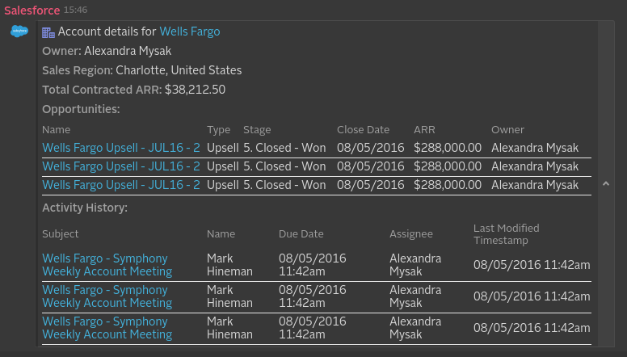
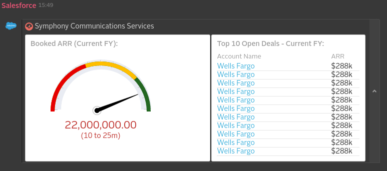

_Note that this project depends on internal Symphony infrastructure (repository.symphony.com), and therefore it can only be built by Symphony LLC employees/partners._

# Salesforce WebHook Integration
The Salesforce WebHook Integration will allow you to receive notifications in Symphony when a Salesforce opportunity changes state.

## How it works
Salesforce does not provide out-of-the-box WebHook support but one can use [this tool](https://salesforce-webhook-creator.herokuapp.com/) to get WebHook-like functionality via *Apex triggers*, automatically created when using the mentioned tool, also known as "Salesforce WebHook Creator".

After the tool is authorized, you can configure a WebHook by choosing a name for it, which "SObject" will it notify, which action to trigger and then paste in the URL you generated in the Salesforce WebHook Application available on Symphony Market. After this, you should be able to start receiving notifications n Symphony platform.

## What formats and events it support and what it produces
Every integration will get a message sent in a specific format (depending on what system is it dealing with) and it will usually convert it into an "entity" before it reaches the Symphony platform.
It will also, usually, identify the kind of message it will deal with based on an "event" identifier, that varies based on which system is it integrating with.

Salesforce supports WebHooks via the tool [Salesforce WebHook Creator](https://salesforce-webhook-creator.herokuapp.com/) and currently there's the possibility to configure up to tree events:

### Opportunity Notification

* Payload sent from Salesforce
```xml
<messageML>
  <entity type="com.symphony.integration.sfdc.event.opportunityNotification" version="1.0">
    <presentationML>
      Alexandra Mysak updated Wells Fargo Upsel - JUL16 - 2 (<a href="https://link.to.the.opportunity.at.salesforce/path/to/the/opportunity/at/salesforce"/>) to stage <b>5. Closed - Won</b>
    </presentationML>
    <attribute name="username" type="org.symphonyoss.string" value="test" />
    <entity type="com.symphony.integration.sfdc.opportunity" version="1.0">
      <attribute name="title" type="org.symphonyoss.string" value="Wells Fargo Upsel - JUL16 - 2"/>
      <attribute name="link" type="com.symphony.uri" value="https://link.to.the.opportunity.at.salesforce/path/to/the/opportunity/at/salesforce"/>
      <attribute name="type" type="org.symphonyoss.string" value="Upsell"/>
      <attribute name="stage" type="org.symphonyoss.string" value="5. Closed - Won"/>
      <attribute name="closeDate" type="org.symphonyoss.time.rfc3339" value="2016-08-05T14:42:09.992Z"/>
      <entity name="arr" type="com.symphony.integration.sfdc.revenue" version="1.0">
        <attribute name="currency" type="org.symphonyoss.fin.ccy" value="USD"/>
        <attribute name="value" type="org.symphony.oss.number.double" value="288000.00"/>
      </entity>
      <entity name="owner" type="com.symphony.integration.sfdc.user" version="1.0">
        <attribute name="username" type="org.symphonyoss.string" value="amysak"/>
        <attribute name="displayName" type="org.symphonyoss.string" value="Alexandra Mysak"/>
        <attribute name="emailAddress" type="org.symphonyoss.string" value="amysak@company.com"/>
      </entity>
    </entity>
    <entity type="com.symphony.integration.sfdc.account" version="1.0">
      <attribute name="name" type="org.symphonyoss.string" value="Wells Fargo"/>
      <attribute name="link" type="com.symphony.uri" value="https://link.to.the.account.at.salesforce/path/to/the/account/at/salesforce"/>
      <attribute name="salesRegion" type="org.symphonyoss.string" value="Americas"/>
      <attribute name="renewalDate" type="org.symphonyoss.time.rfc3339" value="2016-08-05T14:42:09.992Z"/>
      <entity name="totalContractedArr" type="com.symphony.integration.sfdc.revenue" version="1.0">
        <attribute name="currency" type="org.symphonyoss.fin.ccy" value="USD"/>
        <attribute name="value" type="org.symphony.oss.number.double" value="288000.00"/>
      </entity>
      <entity name="owner" type="com.symphony.integration.sfdc.user" version="1.0">
        <attribute name="username" type="org.symphonyoss.string" value="amysak"/>
        <attribute name="displayName" type="org.symphonyoss.string" value="Alexandra Mysak"/>
        <attribute name="emailAddress" type="org.symphonyoss.string" value="amysak@company.com"/>
      </entity>
    </entity>
    <entity name="author" type="com.symphony.integration.sfdc.user" version="1.0">
      <attribute name="username" type="org.symphonyoss.string" value="amysak"/>
      <attribute name="displayName" type="org.symphonyoss.string" value="Alexandra Mysak"/>
      <attribute name="emailAddress" type="org.symphonyoss.string" value="amysak@company.com"/>
    </entity>
  </entity>
</messageML>
```
* Notification on Symphony platform


### Account Status Notification

* Payload sent from Salesforce
```xml
<messageML>
  <entity type="com.symphony.integration.sfdc.event.accountStatus" version="1.0">
    <presentationML>Account details for Wells Fargo (<a href="https://link.to.the.account.at.salesforce/path/to/the/account/at/salesforce"/></presentationML>
    <entity type="com.symphony.integration.sfdc.account" version="1.0">
      <attribute name="name" type="org.symphonyoss.string" value="Wells Fargo"/>
      <attribute name="link" type="com.symphony.uri" value="https://link.to.the.account.at.salesforce/path/to/the/account/at/salesforce"/>
      <attribute name="city" type="org.symphonyoss.string" value="Charlotte"/>
      <attribute name="country" type="org.symphonyoss.string" value="United States"/>
      <entity name="totalAmount" type="com.symphony.integration.sfdc.amount" version="1.0">
        <attribute name="currency" type="org.symphonyoss.fin.ccy" value="USD"/>
        <attribute name="value" type="org.symphony.oss.number.double" value="38212.50"/>
      </entity>
      <entity name="owner" type="com.symphony.integration.sfdc.user" version="1.0">
        <attribute name="username" type="org.symphonyoss.string" value="amysak"/>
        <attribute name="fullName" type="org.symphonyoss.string" value="Alexandra Mysak"/>
        <attribute name="emailAddress" type="org.symphonyoss.string" value="amysak@company.com"/>
      </entity>
    </entity>
    <entity type="com.symphony.integration.sfdc.opportunities" version="1.0">
      <entity name="0" type="com.symphony.integration.sfdc.opportunity" version="1.0">
        <attribute name="name" type="org.symphonyoss.string" value="Wells Fargo Upsell - JUL16 - 2"/>
        <attribute name="link" type="com.symphony.uri" value="https://link.to.the.opportunity.at.salesforce/path/to/the/opportunity/at/salesforce"/>
        <attribute name="type" type="org.symphonyoss.string" value="Upsell"/>
        <attribute name="stage" type="org.symphonyoss.string" value="5. Closed - Won"/>
        <attribute name="closeDate" type="org.symphonyoss.time.rfc3339" value="2016-08-05T14:42:09.992Z"/>
        <entity name="amount" type="com.symphony.integration.sfdc.amount" version="1.0">
          <attribute name="currency" type="org.symphonyoss.fin.ccy" value="USD"/>
          <attribute name="value" type="org.symphony.oss.number.double" value="288000.00"/>
        </entity>
        <entity name="owner" type="com.symphony.integration.sfdc.user" version="1.0">
          <attribute name="username" type="org.symphonyoss.string" value="amysak"/>
          <attribute name="fullName" type="org.symphonyoss.string" value="Alexandra Mysak"/>
          <attribute name="emailAddress" type="org.symphonyoss.string" value="amysak@company.com"/>
        </entity>
      </entity>
      <entity name="1" type="com.symphony.integration.sfdc.opportunity" version="1.0">
        <attribute name="name" type="org.symphonyoss.string" value="Wells Fargo Upsell - JUL16 - 2"/>
        <attribute name="link" type="com.symphony.uri" value="https://link.to.the.opportunity.at.salesforce/path/to/the/opportunity/at/salesforce"/>
        <attribute name="type" type="org.symphonyoss.string" value="Upsell"/>
        <attribute name="stage" type="org.symphonyoss.string" value="5. Closed - Won"/>
        <attribute name="closeDate" type="org.symphonyoss.time.rfc3339" value="2016-08-05T14:42:09.992Z"/>
        <entity name="amount" type="com.symphony.integration.sfdc.amount" version="1.0">
          <attribute name="currency" type="org.symphonyoss.fin.ccy" value="USD"/>
          <attribute name="value" type="org.symphony.oss.number.double" value="288000.00"/>
        </entity>
        <entity name="owner" type="com.symphony.integration.sfdc.user" version="1.0">
          <attribute name="username" type="org.symphonyoss.string" value="amysak"/>
          <attribute name="fullName" type="org.symphonyoss.string" value="Alexandra Mysak"/>
          <attribute name="emailAddress" type="org.symphonyoss.string" value="amysak@company.com"/>
        </entity>
      </entity>
      <entity name="2" type="com.symphony.integration.sfdc.opportunity" version="1.0">
        <attribute name="name" type="org.symphonyoss.string" value="Wells Fargo Upsell - JUL16 - 2"/>
        <attribute name="link" type="com.symphony.uri" value="https://link.to.the.opportunity.at.salesforce/path/to/the/opportunity/at/salesforce"/>
        <attribute name="type" type="org.symphonyoss.string" value="Upsell"/>
        <attribute name="stage" type="org.symphonyoss.string" value="5. Closed - Won"/>
        <attribute name="closeDate" type="org.symphonyoss.time.rfc3339" value="2016-08-05T14:42:09.992Z"/>
        <entity name="amount" type="com.symphony.integration.sfdc.amount" version="1.0">
          <attribute name="currency" type="org.symphonyoss.fin.ccy" value="USD"/>
          <attribute name="value" type="org.symphony.oss.number.double" value="288000.00"/>
        </entity>
        <entity name="owner" type="com.symphony.integration.sfdc.user" version="1.0">
          <attribute name="username" type="org.symphonyoss.string" value="amysak"/>
          <attribute name="fullName" type="org.symphonyoss.string" value="Alexandra Mysak"/>
          <attribute name="emailAddress" type="org.symphonyoss.string" value="amysak@company.com"/>
        </entity>
      </entity>
    </entity>
    <entity type="com.symphony.integration.sfdc.activities" version="1.0">
      <entity name="0" type="com.symphony.integration.sfdc.activity" version="1.0">
        <attribute name="subject" type="org.symphonyoss.string" value="Wells Fargo - Symphony Weekly Account Meeting"/>
        <attribute name="link" type="com.symphony.uri" value="https://link.to.the.activity.at.salesforce/path/to/the/activity/at/salesforce"/>
        <attribute name="dueDate" type="org.symphonyoss.time.rfc3339" value="2016-08-05T14:42:09.992Z"/>
        <attribute name="lastModified" type="org.symphonyoss.time.rfc3339" value="2016-08-05T14:42:09.992Z"/>
        <entity name="author" type="com.symphony.integration.sfdc.user" version="1.0">
          <attribute name="username" type="org.symphonyoss.string" value="mhineman"/>
          <attribute name="fullName" type="org.symphonyoss.string" value="Mark Hineman"/>
          <attribute name="emailAddress" type="org.symphonyoss.string" value="mhineman@company.com"/>
        </entity>
        <entity name="assignee" type="com.symphony.integration.sfdc.user" version="1.0">
          <attribute name="username" type="org.symphonyoss.string" value="amysak"/>
          <attribute name="fullName" type="org.symphonyoss.string" value="Alexandra Mysak"/>
          <attribute name="emailAddress" type="org.symphonyoss.string" value="amysak@company.com"/>
        </entity>
      </entity>
      <entity name="1" type="com.symphony.integration.sfdc.activity" version="1.0">
        <attribute name="subject" type="org.symphonyoss.string" value="Wells Fargo - Symphony Weekly Account Meeting"/>
        <attribute name="link" type="com.symphony.uri" value="https://link.to.the.activity.at.salesforce/path/to/the/activity/at/salesforce"/>
        <attribute name="dueDate" type="org.symphonyoss.time.rfc3339" value="2016-08-05T14:42:09.992Z"/>
        <attribute name="lastModified" type="org.symphonyoss.time.rfc3339" value="2016-08-05T14:42:09.992Z"/>
        <entity name="author" type="com.symphony.integration.sfdc.user" version="1.0">
          <attribute name="username" type="org.symphonyoss.string" value="mhineman"/>
          <attribute name="fullName" type="org.symphonyoss.string" value="Mark Hineman"/>
          <attribute name="emailAddress" type="org.symphonyoss.string" value="mhineman@company.com"/>
        </entity>
        <entity name="assignee" type="com.symphony.integration.sfdc.user" version="1.0">
          <attribute name="username" type="org.symphonyoss.string" value="amysak"/>
          <attribute name="fullName" type="org.symphonyoss.string" value="Alexandra Mysak"/>
          <attribute name="emailAddress" type="org.symphonyoss.string" value="amysak@company.com"/>
        </entity>
      </entity>
      <entity name="2" type="com.symphony.integration.sfdc.activity" version="1.0">
        <attribute name="subject" type="org.symphonyoss.string" value="Wells Fargo - Symphony Weekly Account Meeting"/>
        <attribute name="link" type="com.symphony.uri" value="https://link.to.the.activity.at.salesforce/path/to/the/activity/at/salesforce"/>
        <attribute name="dueDate" type="org.symphonyoss.time.rfc3339" value="2016-08-05T14:42:09.992Z"/>
        <attribute name="lastModified" type="org.symphonyoss.time.rfc3339" value="2016-08-05T14:42:09.992Z"/>
        <entity name="author" type="com.symphony.integration.sfdc.user" version="1.0">
          <attribute name="username" type="org.symphonyoss.string" value="mhineman"/>
          <attribute name="fullName" type="org.symphonyoss.string" value="Mark Hineman"/>
          <attribute name="emailAddress" type="org.symphonyoss.string" value="mhineman@company.com"/>
        </entity>
        <entity name="assignee" type="com.symphony.integration.sfdc.user" version="1.0">
          <attribute name="username" type="org.symphonyoss.string" value="amysak"/>
          <attribute name="fullName" type="org.symphonyoss.string" value="Alexandra Mysak"/>
          <attribute name="emailAddress" type="org.symphonyoss.string" value="amysak@company.com"/>
        </entity>
      </entity>
    </entity>
  </entity>
</messageML>
```

* Notification on Symphony platform



### Executive Dashboard Notification

* Payload sent from Salesforce
```xml
<messageML>
  <entity type="com.symphony.integration.sfdc.event.executiveReport" version="1.0">
    <presentationML></presentationML>
    <entity type="com.symphony.integration.sfdc.salesGauge" version="1.0">
      <attribute name="reportTitle" type="org.symphonyoss.string" value="Booked ARR (Current FY)"/>
      <entity type="com.symphony.integration.sfdc.gauge" version="1.0">
        <attribute name="currentMark" type="org.symphony.oss.number.double" value="22000000"/>
        <entity type="com.symphony.integration.sfdc.gauge.range" version="1.0">
          <attribute name="qualifier" type="org.symphonyoss.string" value="poor" />
          <attribute name="minimum" type="org.symphony.oss.number.double" value="10"/>
          <attribute name="maximum" type="org.symphony.oss.number.double" value="10000000"/>
        </entity>
        <entity type="com.symphony.integration.sfdc.gauge.range" version="1.0">
          <attribute name="qualifier" type="org.symphonyoss.string" value="acceptable" />
          <attribute name="minimum" type="org.symphony.oss.number.double" value="10000000"/>
          <attribute name="maximum" type="org.symphony.oss.number.double" value="19000000"/>
        </entity>
        <entity type="com.symphony.integration.sfdc.gauge.range" version="1.0">
          <attribute name="qualifier" type="org.symphonyoss.string" value="good" />
          <attribute name="minimum" type="org.symphony.oss.number.double" value="19000000"/>
          <attribute name="maximum" type="org.symphony.oss.number.double" value="25000000"/>
        </entity>
      </entity>
    </entity>
    <entity type="com.symphony.integration.sfdc.quarterlyReport" version="1.0">
      <attribute name="reportTitle" type="org.symphonyoss.string" value="Purchased Seats by Quarter"/>
      <attribute name="revenueDescription" type="org.symphonyoss.string" value="Sum of # of New Licenses"/>
      <attribute name="quarterDescription" type="org.symphonyoss.string" value="Close Date"/>
      <entity type="com.symphony.integration.sfdc.quarterReports" version="1.0">
        <entity name="0" type="com.symphony.integration.sfdc.quarterReport" version="1.0">
          <attribute name="year" type="org.symphony.oss.number.int" value="2016"/>
          <attribute name="quarter" type="org.symphony.oss.number.int" value="1"/>
          <entity type="com.symphony.integration.sfdc.revenue" version="1.0">
            <attribute name="currency" type="org.symphonyoss.fin.ccy" value="USD"/>
            <attribute name="value" type="org.symphony.oss.number.double" value="288000.00"/>
          </entity>
        </entity>
        <entity name="1" type="com.symphony.integration.sfdc.quarterReport" version="1.0">
          <attribute name="year" type="org.symphony.oss.number.int" value="2016"/>
          <attribute name="quarter" type="org.symphony.oss.number.int" value="2"/>
          <entity type="com.symphony.integration.sfdc.revenue" version="1.0">
            <attribute name="currency" type="org.symphonyoss.fin.ccy" value="USD"/>
            <attribute name="value" type="org.symphony.oss.number.double" value="28000.00"/>
          </entity>
        </entity>
        <entity name="2" type="com.symphony.integration.sfdc.quarterReport" version="1.0">
          <attribute name="year" type="org.symphony.oss.number.int" value="2016"/>
          <attribute name="quarter" type="org.symphony.oss.number.int" value="3"/>
          <entity type="com.symphony.integration.sfdc.revenue" version="1.0">
            <attribute name="currency" type="org.symphonyoss.fin.ccy" value="USD"/>
            <attribute name="value" type="org.symphony.oss.number.double" value="88000.00"/>
          </entity>
        </entity>
        <entity name="3" type="com.symphony.integration.sfdc.quarterReport" version="1.0">
          <attribute name="year" type="org.symphony.oss.number.int" value="2016"/>
          <attribute name="quarter" type="org.symphony.oss.number.int" value="4"/>
          <entity type="com.symphony.integration.sfdc.revenue" version="1.0">
            <attribute name="currency" type="org.symphonyoss.fin.ccy" value="USD"/>
            <attribute name="value" type="org.symphony.oss.number.double" value="8000.00"/>
          </entity>
        </entity>
        <entity name="4" type="com.symphony.integration.sfdc.quarterReport" version="1.0">
          <attribute name="year" type="org.symphony.oss.number.int" value="2017"/>
          <attribute name="quarter" type="org.symphony.oss.number.int" value="1"/>
          <entity type="com.symphony.integration.sfdc.revenue" version="1.0">
            <attribute name="currency" type="org.symphonyoss.fin.ccy" value="USD"/>
            <attribute name="value" type="org.symphony.oss.number.double" value="12000.00"/>
          </entity>
        </entity>
        <entity name="5" type="com.symphony.integration.sfdc.quarterReport" version="1.0">
          <attribute name="year" type="org.symphony.oss.number.int" value="2017"/>
          <attribute name="quarter" type="org.symphony.oss.number.int" value="2"/>
          <entity type="com.symphony.integration.sfdc.revenue" version="1.0">
            <attribute name="currency" type="org.symphonyoss.fin.ccy" value="USD"/>
            <attribute name="value" type="org.symphony.oss.number.double" value="2000.00"/>
          </entity>
        </entity>
        <entity name="6" type="com.symphony.integration.sfdc.quarterReport" version="1.0">
          <attribute name="year" type="org.symphony.oss.number.int" value="2017"/>
          <attribute name="quarter" type="org.symphony.oss.number.int" value="3"/>
          <entity type="com.symphony.integration.sfdc.revenue" version="1.0">
            <attribute name="currency" type="org.symphonyoss.fin.ccy" value="USD"/>
            <attribute name="value" type="org.symphony.oss.number.double" value="50000.00"/>
          </entity>
        </entity>
      </entity>
    </entity>
    <entity type="com.symphony.integration.sfdc.opportunityReport" version="1.0">
      <attribute name="reportTitle" type="org.symphonyoss.string" value="Top 10 Open Deals - Current FY"/>
      <entity type="com.symphony.integration.sfdc.opportunities" version="1.0">
        <entity name="0" type="com.symphony.integration.sfdc.opportunity" version="1.0">
          <attribute name="name" type="org.symphonyoss.string" value="Wells Fargo Upsel - JUL16 - 2"/>
          <attribute name="link" type="com.symphony.uri" value="https://link.to.the.opportunity.at.salesforce/  path/to/the/opportunity/at/salesforce"/>
          <attribute name="type" type="org.symphonyoss.string" value="Upsell"/>
          <attribute name="stage" type="org.symphonyoss.string" value="5. Closed - Won"/>
          <attribute name="closeDate" type="org.symphonyoss.time.rfc3339" value="2016-08-05T14:42:09.992Z"/>
          <entity name="arr" type="com.symphony.integration.sfdc.amount" version="1.0">
            <attribute name="currency" type="org.symphonyoss.fin.ccy" value="USD"/>
            <attribute name="value" type="org.symphony.oss.number.double" value="288000.00"/>
          </entity>
          <entity name="owner" type="com.symphony.integration.sfdc.user" version="1.0">
            <attribute name="username" type="org.symphonyoss.string" value="amysak"/>
            <attribute name="fullName" type="org.symphonyoss.string" value="Alexandra Mysak"/>
            <attribute name="emailAddress" type="org.symphonyoss.string" value="amysak@company.com"/>
          </entity>
          <entity type="com.symphony.integration.sfdc.account" version="1.0">
            <attribute name="name" type="org.symphonyoss.string" value="Wells Fargo"/>
            <attribute name="link" type="com.symphony.uri" value="https://link.to.the.account.at.salesforce/path/to/the/account/at/salesforce"/>
            <attribute name="city" type="org.symphonyoss.string" value="Charlotte"/>
            <attribute name="country" type="org.symphonyoss.string" value="United States"/>
            <entity name="totalAmount" type="com.symphony.integration.sfdc.totalAmount" version="1.0">
              <attribute name="currency" type="org.symphonyoss.fin.ccy" value="USD"/>
              <attribute name="value" type="org.symphony.oss.number.double" value="288000.00"/>
            </entity>
            <entity name="owner" type="com.symphony.integration.sfdc.user" version="1.0">
              <attribute name="username" type="org.symphonyoss.string" value="amysak"/>
              <attribute name="fullName" type="org.symphonyoss.string" value="Alexandra Mysak"/>
              <attribute name="emailAddress" type="org.symphonyoss.string" value="amysak@company.com"/>
            </entity>
          </entity>
        </entity>
        <entity name="1" type="com.symphony.integration.sfdc.opportunity" version="1.0">
        <attribute name="name" type="org.symphonyoss.string" value="Wells Fargo Upsel - JUL16 - 2"/>
          <attribute name="link" type="com.symphony.uri" value="https://link.to.the.opportunity.at.salesforce/  path/to/the/opportunity/at/salesforce"/>
          <attribute name="type" type="org.symphonyoss.string" value="Upsell"/>
          <attribute name="stage" type="org.symphonyoss.string" value="5. Closed - Won"/>
          <attribute name="closeDate" type="org.symphonyoss.time.rfc3339" value="2016-08-05T14:42:09.992Z"/>
          <entity name="arr" type="com.symphony.integration.sfdc.amount" version="1.0">
            <attribute name="currency" type="org.symphonyoss.fin.ccy" value="USD"/>
            <attribute name="value" type="org.symphony.oss.number.double" value="288000.00"/>
          </entity>
          <entity name="owner" type="com.symphony.integration.sfdc.user" version="1.0">
            <attribute name="username" type="org.symphonyoss.string" value="amysak"/>
            <attribute name="fullName" type="org.symphonyoss.string" value="Alexandra Mysak"/>
            <attribute name="emailAddress" type="org.symphonyoss.string" value="amysak@company.com"/>
          </entity>
          <entity type="com.symphony.integration.sfdc.account" version="1.0">
            <attribute name="name" type="org.symphonyoss.string" value="Wells Fargo"/>
            <attribute name="link" type="com.symphony.uri" value="https://link.to.the.account.at.salesforce/path/to/the/account/at/salesforce"/>
            <attribute name="city" type="org.symphonyoss.string" value="Charlotte"/>
            <attribute name="country" type="org.symphonyoss.string" value="United States"/>
            <entity name="totalAmount" type="com.symphony.integration.sfdc.totalAmount" version="1.0">
              <attribute name="currency" type="org.symphonyoss.fin.ccy" value="USD"/>
              <attribute name="value" type="org.symphony.oss.number.double" value="288000.00"/>
            </entity>
            <entity name="owner" type="com.symphony.integration.sfdc.user" version="1.0">
              <attribute name="username" type="org.symphonyoss.string" value="amysak"/>
              <attribute name="fullName" type="org.symphonyoss.string" value="Alexandra Mysak"/>
              <attribute name="emailAddress" type="org.symphonyoss.string" value="amysak@company.com"/>
            </entity>
          </entity>
        </entity>
        <entity name="2" type="com.symphony.integration.sfdc.opportunity" version="1.0">
          <attribute name="name" type="org.symphonyoss.string" value="Wells Fargo Upsel - JUL16 - 2"/>
          <attribute name="link" type="com.symphony.uri" value="https://link.to.the.opportunity.at.salesforce/  path/to/the/opportunity/at/salesforce"/>
          <attribute name="type" type="org.symphonyoss.string" value="Upsell"/>
          <attribute name="stage" type="org.symphonyoss.string" value="5. Closed - Won"/>
          <attribute name="closeDate" type="org.symphonyoss.time.rfc3339" value="2016-08-05T14:42:09.992Z"/>
          <entity name="arr" type="com.symphony.integration.sfdc.amount" version="1.0">
            <attribute name="currency" type="org.symphonyoss.fin.ccy" value="USD"/>
            <attribute name="value" type="org.symphony.oss.number.double" value="288000.00"/>
          </entity>
          <entity name="owner" type="com.symphony.integration.sfdc.user" version="1.0">
            <attribute name="username" type="org.symphonyoss.string" value="amysak"/>
            <attribute name="fullName" type="org.symphonyoss.string" value="Alexandra Mysak"/>
            <attribute name="emailAddress" type="org.symphonyoss.string" value="amysak@company.com"/>
          </entity>
          <entity type="com.symphony.integration.sfdc.account" version="1.0">
            <attribute name="name" type="org.symphonyoss.string" value="Wells Fargo"/>
            <attribute name="link" type="com.symphony.uri" value="https://link.to.the.account.at.salesforce/path/to/the/account/at/salesforce"/>
            <attribute name="city" type="org.symphonyoss.string" value="Charlotte"/>
            <attribute name="country" type="org.symphonyoss.string" value="United States"/>
            <entity name="totalAmount" type="com.symphony.integration.sfdc.totalAmount" version="1.0">
              <attribute name="currency" type="org.symphonyoss.fin.ccy" value="USD"/>
              <attribute name="value" type="org.symphony.oss.number.double" value="288000.00"/>
            </entity>
            <entity name="owner" type="com.symphony.integration.sfdc.user" version="1.0">
              <attribute name="username" type="org.symphonyoss.string" value="amysak"/>
              <attribute name="fullName" type="org.symphonyoss.string" value="Alexandra Mysak"/>
              <attribute name="emailAddress" type="org.symphonyoss.string" value="amysak@company.com"/>
            </entity>
          </entity>
        </entity>
        <entity name="3" type="com.symphony.integration.sfdc.opportunity" version="1.0">
          <attribute name="name" type="org.symphonyoss.string" value="Wells Fargo Upsel - JUL16 - 2"/>
          <attribute name="link" type="com.symphony.uri" value="https://link.to.the.opportunity.at.salesforce/  path/to/the/opportunity/at/salesforce"/>
          <attribute name="type" type="org.symphonyoss.string" value="Upsell"/>
          <attribute name="stage" type="org.symphonyoss.string" value="5. Closed - Won"/>
          <attribute name="closeDate" type="org.symphonyoss.time.rfc3339" value="2016-08-05T14:42:09.992Z"/>
          <entity name="arr" type="com.symphony.integration.sfdc.amount" version="1.0">
            <attribute name="currency" type="org.symphonyoss.fin.ccy" value="USD"/>
            <attribute name="value" type="org.symphony.oss.number.double" value="288000.00"/>
          </entity>
          <entity name="owner" type="com.symphony.integration.sfdc.user" version="1.0">
            <attribute name="username" type="org.symphonyoss.string" value="amysak"/>
            <attribute name="fullName" type="org.symphonyoss.string" value="Alexandra Mysak"/>
            <attribute name="emailAddress" type="org.symphonyoss.string" value="amysak@company.com"/>
          </entity>
          <entity type="com.symphony.integration.sfdc.account" version="1.0">
            <attribute name="name" type="org.symphonyoss.string" value="Wells Fargo"/>
            <attribute name="link" type="com.symphony.uri" value="https://link.to.the.account.at.salesforce/path/to/the/account/at/salesforce"/>
            <attribute name="city" type="org.symphonyoss.string" value="Charlotte"/>
            <attribute name="country" type="org.symphonyoss.string" value="United States"/>
            <entity name="totalAmount" type="com.symphony.integration.sfdc.totalAmount" version="1.0">
              <attribute name="currency" type="org.symphonyoss.fin.ccy" value="USD"/>
              <attribute name="value" type="org.symphony.oss.number.double" value="288000.00"/>
            </entity>
            <entity name="owner" type="com.symphony.integration.sfdc.user" version="1.0">
              <attribute name="username" type="org.symphonyoss.string" value="amysak"/>
              <attribute name="fullName" type="org.symphonyoss.string" value="Alexandra Mysak"/>
              <attribute name="emailAddress" type="org.symphonyoss.string" value="amysak@company.com"/>
            </entity>
          </entity>
        </entity>
        <entity name="4" type="com.symphony.integration.sfdc.opportunity" version="1.0">
          <attribute name="name" type="org.symphonyoss.string" value="Wells Fargo Upsel - JUL16 - 2"/>
          <attribute name="link" type="com.symphony.uri" value="https://link.to.the.opportunity.at.salesforce/  path/to/the/opportunity/at/salesforce"/>
          <attribute name="type" type="org.symphonyoss.string" value="Upsell"/>
          <attribute name="stage" type="org.symphonyoss.string" value="5. Closed - Won"/>
          <attribute name="closeDate" type="org.symphonyoss.time.rfc3339" value="2016-08-05T14:42:09.992Z"/>
          <entity name="arr" type="com.symphony.integration.sfdc.amount" version="1.0">
            <attribute name="currency" type="org.symphonyoss.fin.ccy" value="USD"/>
            <attribute name="value" type="org.symphony.oss.number.double" value="288000.00"/>
          </entity>
          <entity name="owner" type="com.symphony.integration.sfdc.user" version="1.0">
            <attribute name="username" type="org.symphonyoss.string" value="amysak"/>
            <attribute name="fullName" type="org.symphonyoss.string" value="Alexandra Mysak"/>
            <attribute name="emailAddress" type="org.symphonyoss.string" value="amysak@company.com"/>
          </entity>
          <entity type="com.symphony.integration.sfdc.account" version="1.0">
            <attribute name="name" type="org.symphonyoss.string" value="Wells Fargo"/>
            <attribute name="link" type="com.symphony.uri" value="https://link.to.the.account.at.salesforce/path/to/the/account/at/salesforce"/>
            <attribute name="city" type="org.symphonyoss.string" value="Charlotte"/>
            <attribute name="country" type="org.symphonyoss.string" value="United States"/>
            <entity name="totalAmount" type="com.symphony.integration.sfdc.totalAmount" version="1.0">
              <attribute name="currency" type="org.symphonyoss.fin.ccy" value="USD"/>
              <attribute name="value" type="org.symphony.oss.number.double" value="288000.00"/>
            </entity>
            <entity name="owner" type="com.symphony.integration.sfdc.user" version="1.0">
              <attribute name="username" type="org.symphonyoss.string" value="amysak"/>
              <attribute name="fullName" type="org.symphonyoss.string" value="Alexandra Mysak"/>
              <attribute name="emailAddress" type="org.symphonyoss.string" value="amysak@company.com"/>
            </entity>
          </entity>
        </entity>
        <entity name="5" type="com.symphony.integration.sfdc.opportunity" version="1.0">
          <attribute name="name" type="org.symphonyoss.string" value="Wells Fargo Upsel - JUL16 - 2"/>
          <attribute name="link" type="com.symphony.uri" value="https://link.to.the.opportunity.at.salesforce/  path/to/the/opportunity/at/salesforce"/>
          <attribute name="type" type="org.symphonyoss.string" value="Upsell"/>
          <attribute name="stage" type="org.symphonyoss.string" value="5. Closed - Won"/>
          <attribute name="closeDate" type="org.symphonyoss.time.rfc3339" value="2016-08-05T14:42:09.992Z"/>
          <entity name="arr" type="com.symphony.integration.sfdc.amount" version="1.0">
            <attribute name="currency" type="org.symphonyoss.fin.ccy" value="USD"/>
            <attribute name="value" type="org.symphony.oss.number.double" value="288000.00"/>
          </entity>
          <entity name="owner" type="com.symphony.integration.sfdc.user" version="1.0">
            <attribute name="username" type="org.symphonyoss.string" value="amysak"/>
            <attribute name="fullName" type="org.symphonyoss.string" value="Alexandra Mysak"/>
            <attribute name="emailAddress" type="org.symphonyoss.string" value="amysak@company.com"/>
          </entity>
          <entity type="com.symphony.integration.sfdc.account" version="1.0">
            <attribute name="name" type="org.symphonyoss.string" value="Wells Fargo"/>
            <attribute name="link" type="com.symphony.uri" value="https://link.to.the.account.at.salesforce/path/to/the/account/at/salesforce"/>
            <attribute name="city" type="org.symphonyoss.string" value="Charlotte"/>
            <attribute name="country" type="org.symphonyoss.string" value="United States"/>
            <entity name="totalAmount" type="com.symphony.integration.sfdc.totalAmount" version="1.0">
              <attribute name="currency" type="org.symphonyoss.fin.ccy" value="USD"/>
              <attribute name="value" type="org.symphony.oss.number.double" value="288000.00"/>
            </entity>
            <entity name="owner" type="com.symphony.integration.sfdc.user" version="1.0">
              <attribute name="username" type="org.symphonyoss.string" value="amysak"/>
              <attribute name="fullName" type="org.symphonyoss.string" value="Alexandra Mysak"/>
              <attribute name="emailAddress" type="org.symphonyoss.string" value="amysak@company.com"/>
            </entity>
          </entity>
        </entity>
        <entity name="6" type="com.symphony.integration.sfdc.opportunity" version="1.0">
          <attribute name="name" type="org.symphonyoss.string" value="Wells Fargo Upsel - JUL16 - 2"/>
          <attribute name="link" type="com.symphony.uri" value="https://link.to.the.opportunity.at.salesforce/  path/to/the/opportunity/at/salesforce"/>
          <attribute name="type" type="org.symphonyoss.string" value="Upsell"/>
          <attribute name="stage" type="org.symphonyoss.string" value="5. Closed - Won"/>
          <attribute name="closeDate" type="org.symphonyoss.time.rfc3339" value="2016-08-05T14:42:09.992Z"/>
          <entity name="arr" type="com.symphony.integration.sfdc.amount" version="1.0">
            <attribute name="currency" type="org.symphonyoss.fin.ccy" value="USD"/>
            <attribute name="value" type="org.symphony.oss.number.double" value="288000.00"/>
          </entity>
          <entity name="owner" type="com.symphony.integration.sfdc.user" version="1.0">
            <attribute name="username" type="org.symphonyoss.string" value="amysak"/>
            <attribute name="fullName" type="org.symphonyoss.string" value="Alexandra Mysak"/>
            <attribute name="emailAddress" type="org.symphonyoss.string" value="amysak@company.com"/>
          </entity>
          <entity type="com.symphony.integration.sfdc.account" version="1.0">
            <attribute name="name" type="org.symphonyoss.string" value="Wells Fargo"/>
            <attribute name="link" type="com.symphony.uri" value="https://link.to.the.account.at.salesforce/path/to/the/account/at/salesforce"/>
            <attribute name="city" type="org.symphonyoss.string" value="Charlotte"/>
            <attribute name="country" type="org.symphonyoss.string" value="United States"/>
            <entity name="totalAmount" type="com.symphony.integration.sfdc.totalAmount" version="1.0">
              <attribute name="currency" type="org.symphonyoss.fin.ccy" value="USD"/>
              <attribute name="value" type="org.symphony.oss.number.double" value="288000.00"/>
            </entity>
            <entity name="owner" type="com.symphony.integration.sfdc.user" version="1.0">
              <attribute name="username" type="org.symphonyoss.string" value="amysak"/>
              <attribute name="fullName" type="org.symphonyoss.string" value="Alexandra Mysak"/>
              <attribute name="emailAddress" type="org.symphonyoss.string" value="amysak@company.com"/>
            </entity>
          </entity>
        </entity>
        <entity name="7" type="com.symphony.integration.sfdc.opportunity" version="1.0">
          <attribute name="name" type="org.symphonyoss.string" value="Wells Fargo Upsel - JUL16 - 2"/>
          <attribute name="link" type="com.symphony.uri" value="https://link.to.the.opportunity.at.salesforce/  path/to/the/opportunity/at/salesforce"/>
          <attribute name="type" type="org.symphonyoss.string" value="Upsell"/>
          <attribute name="stage" type="org.symphonyoss.string" value="5. Closed - Won"/>
          <attribute name="closeDate" type="org.symphonyoss.time.rfc3339" value="2016-08-05T14:42:09.992Z"/>
          <entity name="arr" type="com.symphony.integration.sfdc.amount" version="1.0">
            <attribute name="currency" type="org.symphonyoss.fin.ccy" value="USD"/>
            <attribute name="value" type="org.symphony.oss.number.double" value="288000.00"/>
          </entity>
          <entity name="owner" type="com.symphony.integration.sfdc.user" version="1.0">
            <attribute name="username" type="org.symphonyoss.string" value="amysak"/>
            <attribute name="fullName" type="org.symphonyoss.string" value="Alexandra Mysak"/>
            <attribute name="emailAddress" type="org.symphonyoss.string" value="amysak@company.com"/>
          </entity>
          <entity type="com.symphony.integration.sfdc.account" version="1.0">
            <attribute name="name" type="org.symphonyoss.string" value="Wells Fargo"/>
            <attribute name="link" type="com.symphony.uri" value="https://link.to.the.account.at.salesforce/path/to/the/account/at/salesforce"/>
            <attribute name="city" type="org.symphonyoss.string" value="Charlotte"/>
            <attribute name="country" type="org.symphonyoss.string" value="United States"/>
            <entity name="totalAmount" type="com.symphony.integration.sfdc.totalAmount" version="1.0">
              <attribute name="currency" type="org.symphonyoss.fin.ccy" value="USD"/>
              <attribute name="value" type="org.symphony.oss.number.double" value="288000.00"/>
            </entity>
            <entity name="owner" type="com.symphony.integration.sfdc.user" version="1.0">
              <attribute name="username" type="org.symphonyoss.string" value="amysak"/>
              <attribute name="fullName" type="org.symphonyoss.string" value="Alexandra Mysak"/>
              <attribute name="emailAddress" type="org.symphonyoss.string" value="amysak@company.com"/>
            </entity>
          </entity>
        </entity>
        <entity name="8" type="com.symphony.integration.sfdc.opportunity" version="1.0">
          <attribute name="name" type="org.symphonyoss.string" value="Wells Fargo Upsel - JUL16 - 2"/>
          <attribute name="link" type="com.symphony.uri" value="https://link.to.the.opportunity.at.salesforce/  path/to/the/opportunity/at/salesforce"/>
          <attribute name="type" type="org.symphonyoss.string" value="Upsell"/>
          <attribute name="stage" type="org.symphonyoss.string" value="5. Closed - Won"/>
          <attribute name="closeDate" type="org.symphonyoss.time.rfc3339" value="2016-08-05T14:42:09.992Z"/>
          <entity name="arr" type="com.symphony.integration.sfdc.amount" version="1.0">
            <attribute name="currency" type="org.symphonyoss.fin.ccy" value="USD"/>
            <attribute name="value" type="org.symphony.oss.number.double" value="288000.00"/>
          </entity>
          <entity name="owner" type="com.symphony.integration.sfdc.user" version="1.0">
            <attribute name="username" type="org.symphonyoss.string" value="amysak"/>
            <attribute name="fullName" type="org.symphonyoss.string" value="Alexandra Mysak"/>
            <attribute name="emailAddress" type="org.symphonyoss.string" value="amysak@company.com"/>
          </entity>
          <entity type="com.symphony.integration.sfdc.account" version="1.0">
            <attribute name="name" type="org.symphonyoss.string" value="Wells Fargo"/>
            <attribute name="link" type="com.symphony.uri" value="https://link.to.the.account.at.salesforce/path/to/the/account/at/salesforce"/>
            <attribute name="city" type="org.symphonyoss.string" value="Charlotte"/>
            <attribute name="country" type="org.symphonyoss.string" value="United States"/>
            <entity name="totalAmount" type="com.symphony.integration.sfdc.totalAmount" version="1.0">
              <attribute name="currency" type="org.symphonyoss.fin.ccy" value="USD"/>
              <attribute name="value" type="org.symphony.oss.number.double" value="288000.00"/>
            </entity>
            <entity name="owner" type="com.symphony.integration.sfdc.user" version="1.0">
              <attribute name="username" type="org.symphonyoss.string" value="amysak"/>
              <attribute name="fullName" type="org.symphonyoss.string" value="Alexandra Mysak"/>
              <attribute name="emailAddress" type="org.symphonyoss.string" value="amysak@company.com"/>
            </entity>
          </entity>
        </entity>
        <entity name="9" type="com.symphony.integration.sfdc.opportunity" version="1.0">
          <attribute name="name" type="org.symphonyoss.string" value="Wells Fargo Upsel - JUL16 - 2"/>
          <attribute name="link" type="com.symphony.uri" value="https://link.to.the.opportunity.at.salesforce/  path/to/the/opportunity/at/salesforce"/>
          <attribute name="type" type="org.symphonyoss.string" value="Upsell"/>
          <attribute name="stage" type="org.symphonyoss.string" value="5. Closed - Won"/>
          <attribute name="closeDate" type="org.symphonyoss.time.rfc3339" value="2016-08-05T14:42:09.992Z"/>
          <entity name="arr" type="com.symphony.integration.sfdc.amount" version="1.0">
            <attribute name="currency" type="org.symphonyoss.fin.ccy" value="USD"/>
            <attribute name="value" type="org.symphony.oss.number.double" value="288000.00"/>
          </entity>
          <entity name="owner" type="com.symphony.integration.sfdc.user" version="1.0">
            <attribute name="username" type="org.symphonyoss.string" value="amysak"/>
            <attribute name="fullName" type="org.symphonyoss.string" value="Alexandra Mysak"/>
            <attribute name="emailAddress" type="org.symphonyoss.string" value="amysak@company.com"/>
          </entity>
          <entity type="com.symphony.integration.sfdc.account" version="1.0">
            <attribute name="name" type="org.symphonyoss.string" value="Wells Fargo"/>
            <attribute name="link" type="com.symphony.uri" value="https://link.to.the.account.at.salesforce/path/to/the/account/at/salesforce"/>
            <attribute name="city" type="org.symphonyoss.string" value="Charlotte"/>
            <attribute name="country" type="org.symphonyoss.string" value="United States"/>
            <entity name="totalAmount" type="com.symphony.integration.sfdc.totalAmount" version="1.0">
              <attribute name="currency" type="org.symphonyoss.fin.ccy" value="USD"/>
              <attribute name="value" type="org.symphony.oss.number.double" value="288000.00"/>
            </entity>
            <entity name="owner" type="com.symphony.integration.sfdc.user" version="1.0">
              <attribute name="username" type="org.symphonyoss.string" value="amysak"/>
              <attribute name="fullName" type="org.symphonyoss.string" value="Alexandra Mysak"/>
              <attribute name="emailAddress" type="org.symphonyoss.string" value="amysak@company.com"/>
            </entity>
          </entity>
        </entity>
        <entity name="10" type="com.symphony.integration.sfdc.opportunity" version="1.0">
          <attribute name="name" type="org.symphonyoss.string" value="Wells Fargo Upsel - JUL16 - 2"/>
          <attribute name="link" type="com.symphony.uri" value="https://link.to.the.opportunity.at.salesforce/  path/to/the/opportunity/at/salesforce"/>
          <attribute name="type" type="org.symphonyoss.string" value="Upsell"/>
          <attribute name="stage" type="org.symphonyoss.string" value="5. Closed - Won"/>
          <attribute name="closeDate" type="org.symphonyoss.time.rfc3339" value="2016-08-05T14:42:09.992Z"/>
          <entity name="arr" type="com.symphony.integration.sfdc.amount" version="1.0">
            <attribute name="currency" type="org.symphonyoss.fin.ccy" value="USD"/>
            <attribute name="value" type="org.symphony.oss.number.double" value="288000.00"/>
          </entity>
          <entity name="owner" type="com.symphony.integration.sfdc.user" version="1.0">
            <attribute name="username" type="org.symphonyoss.string" value="amysak"/>
            <attribute name="fullName" type="org.symphonyoss.string" value="Alexandra Mysak"/>
            <attribute name="emailAddress" type="org.symphonyoss.string" value="amysak@company.com"/>
          </entity>
          <entity type="com.symphony.integration.sfdc.account" version="1.0">
            <attribute name="name" type="org.symphonyoss.string" value="Wells Fargo"/>
            <attribute name="link" type="com.symphony.uri" value="https://link.to.the.account.at.salesforce/path/to/the/account/at/salesforce"/>
            <attribute name="city" type="org.symphonyoss.string" value="Charlotte"/>
            <attribute name="country" type="org.symphonyoss.string" value="United States"/>
            <entity name="totalAmount" type="com.symphony.integration.sfdc.totalAmount" version="1.0">
              <attribute name="currency" type="org.symphonyoss.fin.ccy" value="USD"/>
              <attribute name="value" type="org.symphony.oss.number.double" value="288000.00"/>
            </entity>
            <entity name="owner" type="com.symphony.integration.sfdc.user" version="1.0">
              <attribute name="username" type="org.symphonyoss.string" value="amysak"/>
              <attribute name="fullName" type="org.symphonyoss.string" value="Alexandra Mysak"/>
              <attribute name="emailAddress" type="org.symphonyoss.string" value="amysak@company.com"/>
            </entity>
          </entity>
        </entity>
      </entity>
    </entity>
  </entity>
</messageML>
```

* Notification on Symphony platform


